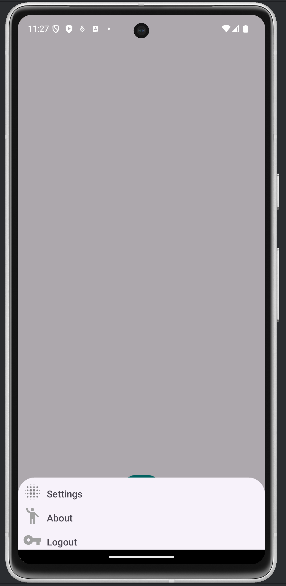
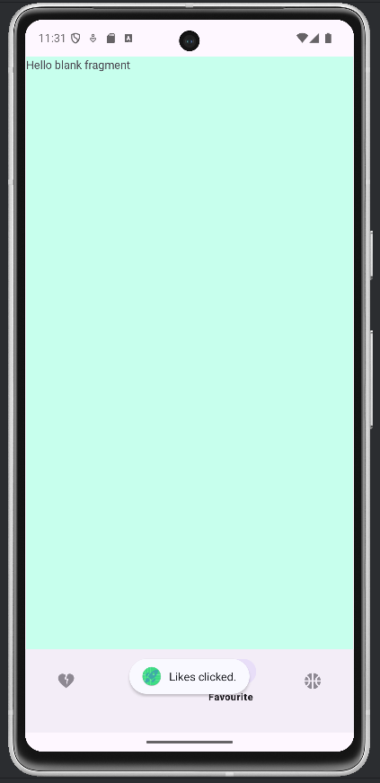

# Nice Start  :rocket::rocket:

### Primera aplicación creada en Desarrollo de Interfaces


De momento ya están realizadas las versiones Portrait y Landscape de la pantalla **login** y la pantalla **signup**.

Estas son algunas capturas de la aplicación:


 

 

 


El menú contextual y el menú desplegable permiten diferentes opciones. 
Entre ellas disparar un cuadro de diálogo.


Se añade un Activity con un botón flotante y un botón hamburger.




Se añade un Activity con Button Navigation, que funciona mediante swipe y con los botones inferiores





Aquí un extracto del código que hace que funcionen los botones:


```
public void openSignup(View v) {

        Intent intent = new Intent(login.this, Signup.class);
        
        startActivity(intent);
        
    }
```

```
public void openMain(View v){
    
        Intent intent = new Intent(login.this, MainActivity.class);
        
        startActivity(intent);
        
    } 
```

#### Últimos cambios

Octubre 2024: Se han añadido animaciones a la pantalla de inicio, así como la pantalla de perfil.

Noviembre 2024: Se ha añadido un Swiper para actualizar la imagen. Un menú contextual y un cuadro de diálogo.

Diciembre y enero 2025: Se añaden Activities con diferentes menús de navegación (floating button y navigation button).

#### Animación del inicio

:tv:[](https://youtu.be/lnR-wquu8TE):tv:


Pronto más cambios!

>Este repositorio tiene una licencia
>[Creativecommons Org Licenses By Sa 4](http://creativecommons.org/licenses/by-sa/4.0/)
